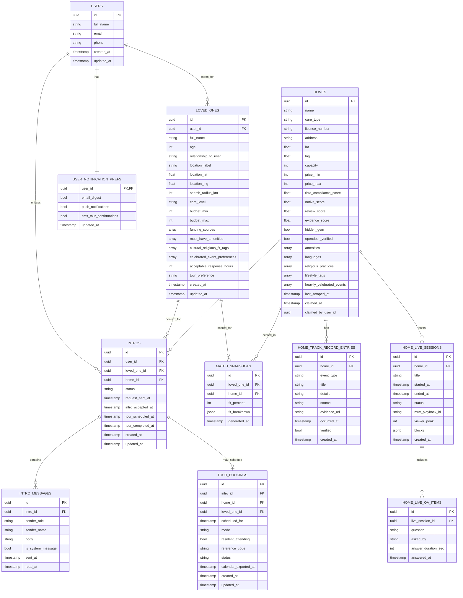

# Supabase Database Model + Calendar for Engineering Work

## Engineering Timeline (6 weeks, 1 product-focused engineer)

| Week | Focus | What gets built |
|---|---|---|
| **1** | Foundation + data pipeline | Set up app shell, design system primitives, Supabase project, auth scaffolding, and baseline schema. Ingest and normalize Ontario retirement home data (name, address, care type, pricing, geo, compliance) into `homes`. Deploy staging. |
| **2** | Browse + trust-first profiles | Build Search tab: list view, filters, fit sorting, Hidden Gems lane. Build Home Profile: amenities, fit context, Track Record preview, OpenDoor session previews. |
| **3** | Onboarding + matching | Build family sign-up/login and separate User vs Loved One records. Implement 3-step intake (care level, budget/funding, amenities, cultural/religious fit + celebrated events, response SLA, tour preference). Ship match scoring + ranked results. |
| **4** | Active Intros + scoped chat | Build intro creation from home profile, Active Intros pipeline states, intro detail timeline, and per-intro chat thread (no global inbox). Add unread markers and notification event hooks. |
| **5** | Tours + profile management | Build schedule tour flow (date/time, in-person/virtual, attendance), confirmation screen, calendar export path, and profile tab with split edit flows (`Edit User` vs `Edit Loved One`). Re-run match scoring when Loved One is edited. |
| **6** | Live trust layer + launch QA | Add OpenDoor Live session model + playback metadata support, complete Track Record UX, harden telemetry, run accessibility/performance QA, bug bash, and launch checklist for production. |

---

## Data Model (Supabase / Postgres)

---
