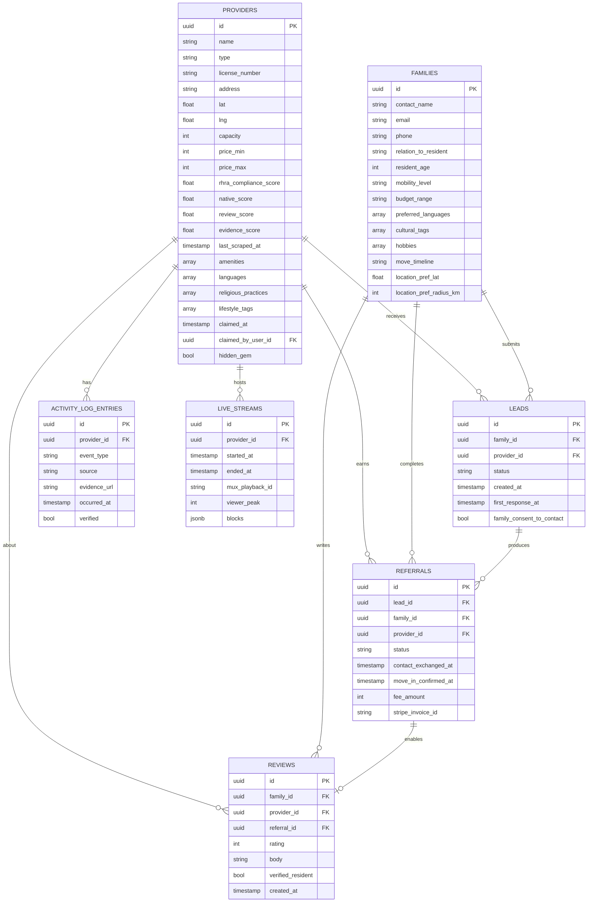

# Supabase Database Model + Calendar for Engineering Work

## Engineering Timeline (4–6 weeks, 1 engineer)

| Week | Focus | What gets built |
|---|---|---|
| **1** | Foundation | Set up the codebase and design system. Build a working MVP shell deployed to staging. Pull all 1,500 Ontario retirement homes from public data and create a profile for each one. |
| **2** | Browse | Search, filters, map view, and provider profile pages. Families can find homes. |
| **3** | Match | Family sign-up form. Matching algorithm. Personalized home recommendations. |
| **4** | Leads | Providers can claim their profile. Families send inquiries. Email and text alerts. Billing for confirmed referrals. |
| **5** | Trust | Track Record (auto-updated activity log). Verified family reviews. Quality score updates. |
| **6** | Polish | Provider analytics dashboard. One creative feature (OpenDoor Live or deeper matching). Final QA and launch. |

---

## Data Model (Supabase / Postgres)

